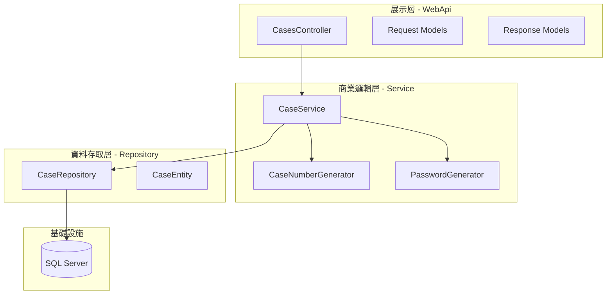
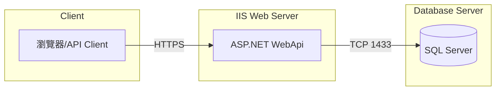

# 案件管理系統架構設計文件

## 1. 專案概述

本專案為一個案件管理系統的 WebApi 後端服務，提供案件的 CRUD 功能。採用 .NET Framework 4.8 與 ASP.NET WebApi 2 開發，遵循 TDD 開發方式。

## 2. 技術堆疊

| 項目 | 技術選型 |
|------|----------|
| 框架 | .NET Framework 4.8 |
| Web 框架 | ASP.NET WebApi 2 |
| DI 容器 | Autofac |
| ORM | Dapper |
| 資料庫 | SQL Server |
| 測試框架 | NUnit + Moq |
| API 風格 | RESTful |

## 3. 專案結構

```
CaseManagement/
├── CaseManagement.WebApi/           # WebApi 主專案
│   ├── App_Start/
│   │   ├── WebApiConfig.cs          # WebApi 路由配置
│   │   └── AutofacConfig.cs         # DI 容器配置
│   ├── Controllers/
│   │   └── CasesController.cs       # 案件 API 控制器
│   ├── Models/
│   │   ├── CreateCaseRequest.cs     # 建立案件請求模型
│   │   └── CreateCaseResponse.cs    # 建立案件回應模型
│   └── Web.config                   # 應用程式配置
│
├── CaseManagement.Service/          # 商業邏輯層
│   ├── Interfaces/
│   │   ├── ICaseService.cs          # 案件服務介面
│   │   └── ICaseNumberGenerator.cs  # 案件編號產生器介面
│   ├── Implementations/
│   │   ├── CaseService.cs           # 案件服務實作
│   │   └── CaseNumberGenerator.cs   # 案件編號產生器實作
│   └── Models/
│       └── CaseDto.cs               # 案件資料傳輸物件
│
├── CaseManagement.Repository/       # 資料存取層
│   ├── Interfaces/
│   │   └── ICaseRepository.cs       # 案件儲存庫介面
│   ├── Implementations/
│   │   └── CaseRepository.cs        # 案件儲存庫實作
│   └── Entities/
│       └── CaseEntity.cs            # 案件實體
│
├── CaseManagement.Common/           # 共用元件
│   ├── Helpers/
│   │   └── PasswordGenerator.cs     # 密碼產生器
│   └── Constants/
│       └── CaseStatus.cs            # 案件狀態常數
│
└── CaseManagement.Tests/            # 測試專案
    ├── Controllers/
    │   └── CasesControllerTests.cs
    ├── Services/
    │   └── CaseServiceTests.cs
    └── Repositories/
        └── CaseRepositoryTests.cs
```

## 4. 分層架構設計

系統採用三層式架構，各層職責明確分離：



### 4.1 展示層 (Presentation Layer)

- **職責**：處理 HTTP 請求/回應、參數驗證、路由
- **元件**：Controllers、Request/Response Models
- **依賴**：Service Layer

### 4.2 商業邏輯層 (Business Logic Layer)

- **職責**：實作業務邏輯、案件編號產生、密碼產生
- **元件**：Services、DTOs、Helpers
- **依賴**：Repository Layer

### 4.3 資料存取層 (Data Access Layer)

- **職責**：資料庫 CRUD 操作、SQL 查詢
- **元件**：Repositories、Entities
- **依賴**：Database

## 5. DI 容器配置

使用 Autofac 作為 DI 容器，配置方式如下：

### 5.1 AutofacConfig.cs

```csharp
public class AutofacConfig
{
    public static IContainer Container { get; private set; }

    public static void Configure()
    {
        var builder = new ContainerBuilder();

        // 註冊 WebApi Controllers
        builder.RegisterApiControllers(Assembly.GetExecutingAssembly());

        // 註冊 Services
        builder.RegisterType<CaseService>()
               .As<ICaseService>()
               .InstancePerRequest();

        builder.RegisterType<CaseNumberGenerator>()
               .As<ICaseNumberGenerator>()
               .InstancePerRequest();

        // 註冊 Repositories
        builder.RegisterType<CaseRepository>()
               .As<ICaseRepository>()
               .InstancePerRequest();

        // 註冊資料庫連線
        builder.Register(c => new SqlConnection(
            ConfigurationManager.ConnectionStrings["CaseDB"].ConnectionString))
               .As<IDbConnection>()
               .InstancePerRequest();

        Container = builder.Build();

        // 設定 WebApi DependencyResolver
        GlobalConfiguration.Configuration.DependencyResolver = 
            new AutofacWebApiDependencyResolver(Container);
    }
}
```

### 5.2 Global.asax.cs

```csharp
public class WebApiApplication : System.Web.HttpApplication
{
    protected void Application_Start()
    {
        GlobalConfiguration.Configure(WebApiConfig.Register);
        AutofacConfig.Configure();
    }
}
```

## 6. 資料庫連線配置

### 6.1 Web.config 連線字串

```xml
<connectionStrings>
    <add name="CaseDB" 
         connectionString="Server=SERVER1;Database=CaseManagement;User Id=sqlaccount;Password=sqlpassword;TrustServerCertificate=True;" 
         providerName="System.Data.SqlClient" />
</connectionStrings>
```

### 6.2 連線資訊

| 項目 | 值 |
|------|-----|
| Server | SERVER1 |
| IP | localhost |
| 帳號 | sqlaccount |
| 密碼 | sqlpassword |
| 資料庫名稱 | CaseManagement |

## 7. 核心元件設計

### 7.1 案件編號產生器 (CaseNumberGenerator)

```csharp
public interface ICaseNumberGenerator
{
    string Generate(DateTime date);
}

public class CaseNumberGenerator : ICaseNumberGenerator
{
    private readonly ICaseRepository _caseRepository;

    public CaseNumberGenerator(ICaseRepository caseRepository)
    {
        _caseRepository = caseRepository;
    }

    public string Generate(DateTime date)
    {
        // 格式：yyyyMMdd-00001
        var datePrefix = date.ToString("yyyyMMdd");
        var todayCount = _caseRepository.GetTodayCaseCount(date);
        var sequence = (todayCount + 1).ToString("D5");
        return $"{datePrefix}-{sequence}";
    }
}
```

### 7.2 密碼產生器 (PasswordGenerator)

```csharp
public static class PasswordGenerator
{
    private static readonly Random _random = new Random();

    public static string Generate()
    {
        // 產生6位數字密碼
        return _random.Next(100000, 999999).ToString();
    }
}
```

## 8. TDD 開發流程

### 8.1 測試優先原則

1. **Red**：先撰寫失敗的測試案例
2. **Green**：撰寫最少量的程式碼使測試通過
3. **Refactor**：重構程式碼，保持測試通過

### 8.2 測試範例

```csharp
[TestFixture]
public class CaseServiceTests
{
    private Mock<ICaseRepository> _mockRepository;
    private Mock<ICaseNumberGenerator> _mockNumberGenerator;
    private ICaseService _caseService;

    [SetUp]
    public void Setup()
    {
        _mockRepository = new Mock<ICaseRepository>();
        _mockNumberGenerator = new Mock<ICaseNumberGenerator>();
        _caseService = new CaseService(_mockRepository.Object, _mockNumberGenerator.Object);
    }

    [Test]
    public void CreateCase_WithValidInput_ShouldReturnCaseWithGeneratedNumber()
    {
        // Arrange
        var subject = "測試主旨";
        var content = "測試內容";
        var expectedCaseNumber = "20260303-00001";
        
        _mockNumberGenerator.Setup(x => x.Generate(It.IsAny<DateTime>()))
                           .Returns(expectedCaseNumber);
        _mockRepository.Setup(x => x.Insert(It.IsAny<CaseEntity>()))
                      .Returns(true);

        // Act
        var result = _caseService.CreateCase(subject, content);

        // Assert
        Assert.IsNotNull(result);
        Assert.AreEqual(expectedCaseNumber, result.CaseNumber);
        Assert.IsNotNull(result.Password);
        Assert.AreEqual(6, result.Password.Length);
    }
}
```

## 9. 錯誤處理策略

### 9.1 全域例外處理

```csharp
public class GlobalExceptionHandler : ExceptionHandler
{
    public override void Handle(ExceptionHandlerContext context)
    {
        var exception = context.Exception;
        var response = new HttpResponseMessage(HttpStatusCode.InternalServerError)
        {
            Content = new StringContent(JsonConvert.SerializeObject(new
            {
                Success = false,
                Message = "系統發生錯誤，請稍後再試",
                ErrorCode = "SYSTEM_ERROR"
            })),
            ReasonPhrase = "Internal Server Error"
        };
        
        context.Result = new ResponseMessageResult(response);
    }
}
```

## 10. 安全性考量

1. **密碼儲存**：案件密碼以明文儲存（依需求），如需加強可考慮雜湊處理
2. **SQL 注入防護**：使用參數化查詢
3. **輸入驗證**：在 Controller 層進行請求參數驗證
4. **HTTPS**：建議生產環境啟用 HTTPS

## 11. 部署架構


